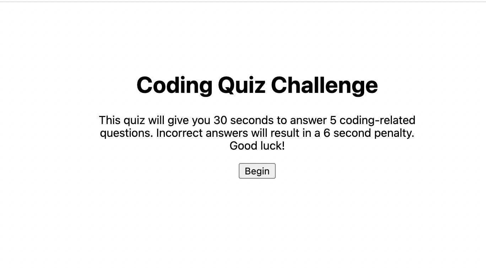

# hw4-code-quiz
Web APIs

## Elevator Pitch
---
Created a timed coding quiz that can save highscores and will penalize user if incorrect answers are chosen

## Application 
---
* When user presses "start quiz" button, the first question in the quiz will appear
* If user guesses incorrectly, 6 seconds will be taken off of the 30 second timer
* Once all questions have been answered (or time runs out), user can enter their initials and save their score
* User can also view their highscores by clicking "view highscores" 

## Current Challenges 
---
Find a way to get the next questions to appear. Also display highscores